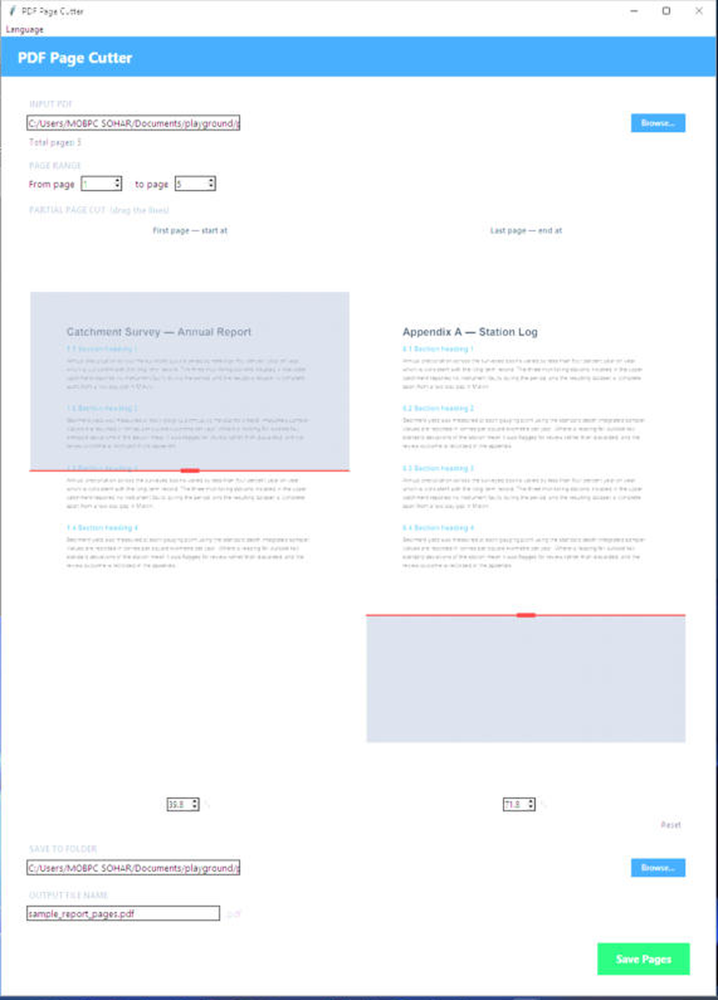
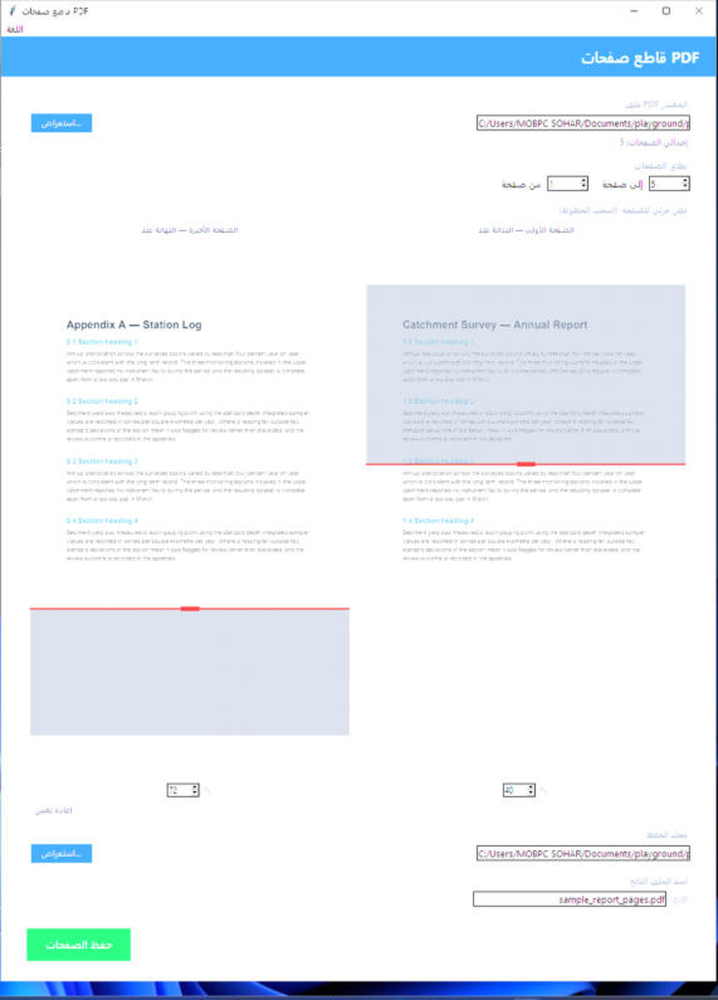

# PDF Page Cutter · قاطع صفحات PDF

A small desktop app for Windows and macOS that extracts a range of pages from a PDF — and, when you need it, cuts **partway into** the first and last page, permanently deleting the content you didn't select.

Bilingual interface: **English** and **العربية**, with a proper right-to-left layout.

Created by **Muaadh Alhamdi**.



---

## Why this exists

Most page-extraction tools work in whole pages. That's a problem when a chapter starts halfway down page 45 and ends a third of the way into page 60 — you either take too much or lose content.

This app lets you drag a cut line onto a preview of the first and last page and keep exactly the span you want. The discarded portion is **deleted from the file**, not painted over, so it will not reappear in a text extractor. That matters if the output feeds a search index or a RAG pipeline.

---

## Features

- Extract any page range from a PDF
- **Partial page cuts** — start partway down the first page, end partway down the last
- Live thumbnails of the first and last page with draggable cut lines
- Cut-away content is genuinely removed: text, images and vector art
- Handles rotated pages (`/Rotate 90/180/270`) correctly
- Resizable window — the previews grow with it
- English and Arabic UI, switchable at any time, with RTL layout
- Remembers your language choice

| English | العربية |
|---|---|
|  |  |

---

## Install

### Windows — Installer (easiest)

1. Download `PDFPageCutter_Setup.exe` from the [Releases](../../releases) page.
2. Run it and follow the prompts.
3. Pick **English** or **العربية** on the first screen.

The app then appears in the Start Menu, optionally on your Desktop, and can be removed from **Settings → Apps**.

### macOS — DMG (easiest)

1. Download `PDFPageCutter_Mac.dmg` from the [Releases](../../releases) page.
2. Open it and drag **PDF Page Cutter** into **Applications**.
3. The first time you open it, macOS will say it's from an unidentified developer (the app isn't signed with a paid Apple Developer ID). Right-click the app → **Open** → **Open** again to confirm once; after that it launches normally.

### Run from source (any OS)

Requires **Python 3.10 or newer**, built with Tkinter support.

```bash
git clone https://github.com/realmuaadh/pdf-page-cutter.git
cd pdf-page-cutter
pip install pypdf pypdfium2 Pillow PyMuPDF
python pdf_cutter.py
```

- On Windows, double-click **`run.bat`**, which installs anything missing and launches the app.
- On macOS/Linux, run **`./run.sh`** instead. On macOS, Apple's built-in Python doesn't ship Tkinter — if `run.sh` complains it's missing, install a Python that has it with `brew install python-tk` (matched to the `python3` you're using, e.g. `python-tk@3.11`).

**What each dependency does**

| Package | Needed for | Required? |
|---|---|---|
| `pypdf` | reading PDFs and extracting the page range | yes |
| `PyMuPDF` | deleting content in a partial cut | only for partial cuts |
| `pypdfium2` + `Pillow` | rendering the page thumbnails | optional — without them you get numeric entry instead of previews |

---

## How to use

1. **Browse…** and pick your PDF. The page count appears and the range fills in automatically.
2. Set **From page** / **to page**.
3. *(Optional)* Under **PARTIAL PAGE CUT**, drag the red line on either thumbnail, or type an exact percentage. The hatched grey area is what gets deleted. **Reset** returns to whole pages (0% / 100%).
4. Choose an output folder and file name.
5. **Save Pages**.

**Example** — a chapter that begins halfway down page 45 and ends three quarters of the way into page 60: set the range to `45` → `60`, the first-page line to `50`, and the last-page line to `75`.

> **Tip:** maximise the window. The thumbnails scale up with it, which makes placing the cut line on a dense page far easier.

---

## About the partial cut

The cut is a true removal, not a visual cover-up. Text, images and vector art inside the discarded band are stripped from the file and the band is left white; the page keeps its original size, so surrounding pages are unaffected.

This was verified by extracting text from the output with three independent engines — pypdf, PyMuPDF and pdfium — which all agree on exactly the surviving content, and by decompressing every stream in the output file and confirming the discarded text is not present anywhere in it.

**Two things to know:**

- Removal is glyph-level, so a line of text sitting exactly on the cut line loses the characters inside the band and keeps the rest. Nudge the line a percent or two if a boundary line comes out half-eaten.
- On a rotated page a horizontal cut runs across every line of text rather than between lines, so expect the boundary to fall mid-word. This is inherent to cutting a rotated page horizontally, not a bug.

---

## Build from source

### Windows

```bash
pip install pypdf pypdfium2 Pillow PyMuPDF pyinstaller

# Use the .spec file — it bundles the pdfium and MuPDF binaries
python -m PyInstaller "PDF Page Cutter.spec"

# Installer (requires Inno Setup 6: winget install JRSoftware.InnoSetup)
"C:\Program Files (x86)\Inno Setup 6\ISCC.exe" installer.iss
```

Outputs land in `dist\` and `installer_output\`. Or just run `build.bat`, which does all of the above.

### macOS

```bash
./build_mac.sh
```

Builds `pdf_cutter.icns`, then `dist/PDF Page Cutter.app` and `installer_output/PDFPageCutter_Mac.dmg`. Needs the Xcode Command Line Tools (for `iconutil`) — install with `xcode-select --install` if you don't already have them.

---

## Repository layout

```
pdf_cutter.py             Main application
run.bat / run.sh          Install dependencies and launch (Windows / macOS+Linux)
build.bat / build_mac.sh  Build the executable and installer (Windows / macOS)
PDF Page Cutter.spec      PyInstaller build definition (both platforms)
installer.iss             Inno Setup installer script (Windows)
make_icon.py              Windows .ico icon generator
make_icon_mac.py          macOS .icns icon generator
docs/                     Screenshots and a sample PDF
dist/                     Built executable / app bundle
installer_output/         Built installer (.exe / .dmg)
```

---

## Licence

Released under the **GNU AGPL-3.0** — see [LICENSE](LICENSE).

The app depends on [PyMuPDF](https://github.com/pymupdf/PyMuPDF) for the partial-cut feature, which is itself AGPL-3.0. Distributing a build that bundles it means the combined work is AGPL, and anyone who receives a binary must be able to get the source. Licensing the project as AGPL keeps that consistent. Artifex offers a commercial PyMuPDF licence for anyone who needs different terms.

---

Created by **Muaadh Alhamdi**.
